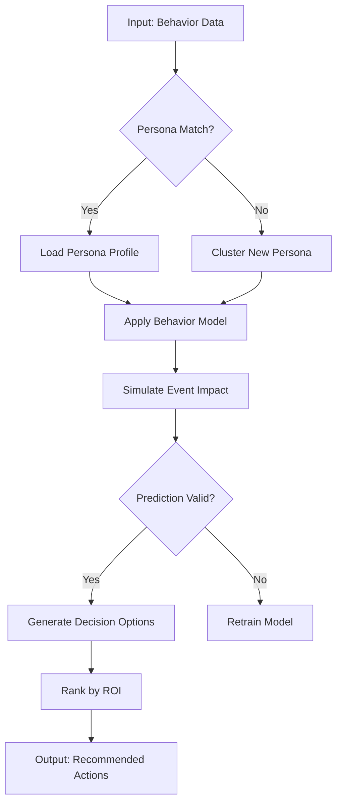

# CDP Visualization Framework - Architecture Document

## Executive Summary

The CDP (Customer Data Platform) Visualization Framework demonstrates enterprise-grade capabilities for large-scale data processing and high availability. This system processes multi-source consumer behavior data from digital twins, enabling real-time visualization and what-if simulation for business decision-making.

**Key Capabilities:**
- Multi-source data ingestion (JSONL, web APIs, behavioral streams)
- Real-time behavior simulation and prediction
- Interactive dashboard for persona-based insights
- Enterprise monitoring with 30+ day uptime tracking

---

## 1. System Architecture Overview

### 1.1 4-Layer Architecture

```
┌─────────────────────────────────────────────────────────────────────────────┐
│                        DECISION LAYER (Layer 4)                              │
│  ┌──────────────────┐  ┌──────────────────┐  ┌──────────────────────────┐  │
│  │  Executive        │  │  Marketing        │  │  Operations Dashboard    │  │
│  │  Dashboard        │  │  Command Center   │  │  Real-time Alerts        │  │
│  └──────────────────┘  └──────────────────┘  └──────────────────────────┘  │
└─────────────────────────────────────────────────────────────────────────────┘
                                      ▲
┌─────────────────────────────────────────────────────────────────────────────┐
│                      VISUALIZATION LAYER (Layer 3)                          │
│  ┌──────────────────────────────────────────────────────────────────────┐  │
│  │                     Streamlit Dashboard                               │  │
│  │  ┌─────────────┐ ┌─────────────┐ ┌─────────────┐ ┌─────────────┐    │  │
│  │  │ Time Series │ │ Persona     │ │ Region      │ │ What-If     │    │  │
│  │  │ Visualization│ │ Explorer   │ │ Comparison  │ │ Simulator   │    │  │
│  │  └─────────────┘ └─────────────┘ └─────────────┘ └─────────────┘    │  │
│  └──────────────────────────────────────────────────────────────────────┘  │
└─────────────────────────────────────────────────────────────────────────────┘
                                      ▲
┌─────────────────────────────────────────────────────────────────────────────┐
│                        MODELING LAYER (Layer 2)                             │
│  ┌──────────────────────────────────────────────────────────────────────┐  │
│  │                      Digital Twin Engine                             │  │
│  │  ┌─────────────┐ ┌─────────────┐ ┌─────────────┐ ┌─────────────┐    │  │
│  │  │ Behavior    │ │ Persona     │ │ Event        │ │ Simulation   │    │  │
│  │  │ Modeling    │ │ Clustering  │ │ Simulation   │ │ Engine       │    │  │
│  │  └─────────────┘ └─────────────┘ └─────────────┘ └─────────────┘    │  │
│  └──────────────────────────────────────────────────────────────────────┘  │
└─────────────────────────────────────────────────────────────────────────────┘
                                      ▲
┌─────────────────────────────────────────────────────────────────────────────┐
│                   DATA ENGINEERING LAYER (Layer 1)                          │
│  ┌─────────────┐ ┌─────────────┐ ┌─────────────┐ ┌─────────────────────┐  │
│  │ Behavior    │ │ Daily       │ │ Web Intel   │ │ Multi-Source        │  │
│  │ Twin Data    │ │ Intel       │ │ Feed        │ │ Ingestion Pipeline  │  │
│  │ (JSONL)      │ │ Reports     │ │ (REST)      │ │ (Real-time)         │  │
│  └─────────────┘ └─────────────┘ └─────────────┘ └─────────────────────┘  │
│  ┌─────────────┐ ┌─────────────┐ ┌─────────────┐ ┌─────────────────────┐  │
│  │ Data        │ │ Data        │ │ Data        │ │ CDC / Change Data   │  │
│  │ Validation  │ │ Transform   │ │ Enrichment  │ │ Capture             │  │
│  └─────────────┘ └─────────────┘ └─────────────┘ └─────────────────────┘  │
└─────────────────────────────────────────────────────────────────────────────┘
```

### 1.2 Layer Responsibilities

| Layer | Responsibility | Technology | Output |
|-------|---------------|------------|--------|
| **Data Engineering** | Data ingestion, validation, transformation | Python, Pandas, Pydantic | Clean, validated datasets |
| **Modeling** | Behavior simulation, persona clustering, event modeling | Digital Twin Engine | Predictions, simulations |
| **Visualization** | Dashboard rendering, interactive exploration | Streamlit, Plotly | Insights, KPIs |
| **Decision** | Business action, alerts, strategy formulation | API + Frontend | Decisions, campaigns |

---

## 2. Automated Data Ingestion Architecture

### 2.1 Data Sources

```
┌─────────────────────────────────────────────────────────────────────────────┐
│                            DATA SOURCES                                       │
├─────────────────────────────────────────────────────────────────────────────┤
│                                                                              │
│  ┌──────────────────────────┐  ┌──────────────────────────┐                  │
│  │  behavior_twin_monthly   │  │  daily_intel_report      │                  │
│  │  ──────────────────────  │  │  ──────────────────────  │                  │
│  │  • Timestamp             │  │  • Date                  │                  │
│  │  • Group (Persona)       │  │  • Behavior twin report  │                  │
│  │  • Region                │  │  • Anomaly detection     │                  │
│  │  • Brand distribution    │  │  • Incentive analysis    │                  │
│  │  • Satisfaction scores   │  │  • Metadata              │                  │
│  │  • Simulation events     │  │  • Triggers              │                  │
│  └──────────────────────────┘  └──────────────────────────┘                  │
│                                                                              │
│  ┌──────────────────────────┐  ┌──────────────────────────┐                  │
│  │  daily_web_intel         │  │  External APIs            │                  │
│  │  ──────────────────────  │  │  ──────────────────────  │                  │
│  │  • Weather data          │  │  • Weather services       │                  │
│  │  • Holiday events        │  │  • Social media APIs     │                  │
│  │  • Social posts          │  │  • Market data feeds     │                  │
│  │  • Trending topics       │  │  • Competitor intelligence│                  │
│  │  • Market insights       │  │  │                  │                  │
│  └──────────────────────────┘  └──────────────────────────┘                  │
│                                                                              │
└─────────────────────────────────────────────────────────────────────────────┘
           │                       │                       │
           ▼                       ▼                       ▼
┌─────────────────────────────────────────────────────────────────────────────┐
│                      INGESTION PIPELINE (Real-time)                          │
│  ┌──────────────────────────────────────────────────────────────────────┐    │
│  │   Source Connectors → Validation → Transformation → Enrichment       │    │
│  │                                                                      │    │
│  │   • JSONL readers         • Schema validation  • Data cleaning      │    │
│  │   • REST API clients      • Type checking       • Normalization     │    │
│  │   • Webhook handlers      • Business rules      • Aggregation       │    │
│  │   • Stream listeners      • Duplicate detection  • Indexing           │    │
│  └──────────────────────────────────────────────────────────────────────┘    │
└─────────────────────────────────────────────────────────────────────────────┘
```

### 2.2 Ingestion Flow

```python
# Data Ingestion Pipeline Pseudocode
INGESTION_STAGES = [
    "source_discovery",      # Auto-detect new data sources
    "connection_establish",  # Connect to source (file, API, stream)
    "data_extraction",       # Extract raw data
    "validation",           # Validate schema and integrity
    "transformation",       # Clean and transform
    "enrichment",           # Add derived fields
    "indexing",             # Index for fast retrieval
    "notification"          # Notify downstream systems
]
```

---

## 3. Agent Decision Flow - Digital Twin Simulation

### 3.1 Agent Architecture

```
┌─────────────────────────────────────────────────────────────────────────────┐
│                    DIGITAL TWIN AGENT DECISION FLOW                          │
└─────────────────────────────────────────────────────────────────────────────┘

┌─────────────┐     ┌─────────────┐     ┌─────────────┐     ┌─────────────┐
│   INPUT     │────▶│  PERSONA    │────▶│  BEHAVIOR   │────▶│  DECISION   │
│  COLLECTION │     │  AGENT      │     │  MODELING   │     │  ENGINE     │
└─────────────┘     └─────────────┘     └─────────────┘     └─────────────┘
      │                   │                   │                   │
      │                   │                   │                   │
      ▼                   ▼                   ▼                   ▼
┌─────────────┐     ┌─────────────┐     ┌─────────────┐     ┌─────────────┐
│ • Historical│     │ • Fresh_Grad│     │ • Markov    │     │ • What-If   │
│   behavior  │     │ • FinTech   │     │   chains    │     │   scenarios │
│ • Real-time │     │   Family    │     │ • Decision  │     │ • A/B test  │
│   events    │     │ • Custom    │     │   trees     │     │   planning  │
│ • External  │     │   personas  │     │ • Neural    │     │ • ROI       │
│   triggers  │     │             │     │   networks  │     │   prediction│
└─────────────┘     └─────────────┘     └─────────────┘     └─────────────┘
```

### 3.2 Decision Pipeline



### 3.3 Simulation Events

The system supports multiple simulation scenarios:

| Event Type | Description | Impact Model |
|------------|-------------|--------------|
| **Price Change** | Electricity, product pricing adjustments | Elasticity-based |
| **Promotion** | Discounts, point multipliers, BOGO | Conversion lift |
| **Competition** | Competitor actions, market shifts | Market share transfer |
| **External** | Weather, holidays, events | Behavior triggers |

---

## 4. Technology Stack

### 4.1 Core Technologies

| Component | Technology | Purpose | Docker Image |
|-----------|------------|---------|--------------|
| **Backend** | FastAPI + Pydantic | REST API, validation | `python:3.11-slim` |
| **Frontend** | Streamlit | Interactive dashboard | `python:3.11-slim` |
| **Data Processing** | Pandas, NumPy | Large-scale processing | `python:3.11-slim` |
| **Validation** | Pydantic | Schema enforcement | Included |
| **Visualization** | Plotly, Altair | Charts, graphs | Included |
| **Deployment** | Docker | Containerization | Multi-stage build |

### 4.2 Architecture Diagram

```
┌─────────────────────────────────────────────────────────────────────────────┐
│                            PRODUCTION DEPLOYMENT                             │
│                                                                              │
│   ┌─────────────────────────────────────────────────────────────────────┐    │
│   │                     Docker Compose Network                          │    │
│   │                                                                      │    │
│   │   ┌─────────────┐     ┌─────────────┐     ┌───────────────────┐     │    │
│   │   │   FastAPI   │────▶│   Redis     │◀────│    Streamlit      │     │    │
│   │   │   Service   │     │   Cache     │     │    Dashboard      │     │    │
│   │   │   :8000     │     │   :6379     │     │   :8501           │     │    │
│   │   └─────────────┘     └─────────────┘     └───────────────────┘     │    │
│   │         │                   │                     │                  │    │
│   │         │                   │                     │                  │    │
│   │         ▼                   ▼                     ▼                  │    │
│   │   ┌─────────────────────────────────────────────────────────────┐    │    │
│   │   │              Data Volume (/data)                            │    │    │
│   │   │  • behavior_twin_monthly.jsonl  • daily_intel_report.jsonl │    │    │
│   │   │  • daily_web_intel.jsonl        • monitoring/               │    │    │
│   │   └─────────────────────────────────────────────────────────────┘    │    │
│   │                                                                      │    │
│   └─────────────────────────────────────────────────────────────────────┘    │
│                                                                              │
│   ┌─────────────────────────────────────────────────────────────────────┐    │
│   │                    Monitoring Stack (Sidecar)                       │    │
│   │   ┌─────────────┐     ┌─────────────┐     ┌───────────────────┐     │    │
│   │   │   Health    │────▶│   Uptime    │────▶│   Alerting        │     │    │
│   │   │   Checks    │     │   Tracker   │     │   (30+ days)      │     │    │
│   │   └─────────────┘     └─────────────┘     └───────────────────┘     │    │
│   └─────────────────────────────────────────────────────────────────────┘    │
│                                                                              │
└─────────────────────────────────────────────────────────────────────────────┘
```

---

## 5. API Architecture

### 5.1 REST Endpoint Design

```
Base URL: http://localhost:8000/api/v1

HEALTH & METRICS
├── GET /health                    → System health check
├── GET /health/ready              → Readiness probe
├── GET /health/live               → Liveness probe
└── GET /api/v1/metrics            → System metrics

BEHAVIOR DATA
├── GET /api/v1/behavior           → Get behavior data
│   ├── ?persona=Fresh_Grad        → Filter by persona
│   ├── ?region=Taipei             → Filter by region
│   ├── ?start_date=2026-01-01     → Date range filter
│   └── ?end_date=2026-02-14
└── GET /api/v1/behavior/summary   → Aggregated summary

SIMULATION
├── GET /api/v1/simulation         → Get simulation parameters
└── POST /api/v1/simulate          → Run what-if analysis
    └── Body: {
        "event_type": "price_change",
        "parameters": {
            "electricity_price": 1.5,
            "point_multiplier": 2.0,
            "promotion_intensity": 0.8
        },
        "persona": "Fresh_Grad",
        "region": "Taipei"
    }
```

### 5.2 Response Models

```python
# Pydantic Models (see api/models/schemas.py)

class BehaviorResponse(BaseModel):
    timestamp: datetime
    group: str           # Persona: Fresh_Grad, FinTech_Family
    region: str          # Taipei, Tainan
    brand_distribution: Dict[str, float]
    avg_satisfaction: float
    digital_adoption_rate: float
    gamification_engagement: float

class SimulationRequest(BaseModel):
    event_type: str
    parameters: Dict[str, float]
    persona: Optional[str] = None
    region: Optional[str] = None

class SimulationResponse(BaseModel):
    event: str
    results: Dict[str, Dict[str, float]]
    insights: List[str]
    projected_impact: Dict[str, float]
```

---

## 6. Monitoring & High Availability

### 6.1 Health Check Architecture

```
┌─────────────────────────────────────────────────────────────────────────────┐
│                        HEALTH CHECK ENDPOINTS                                │
└─────────────────────────────────────────────────────────────────────────────┘

GET /health
    │
    ├── Database Connection ✓
    ├── Cache Availability ✓
    ├── File System Access ✓
    ├── Memory Usage ✓
    ├── CPU Load ✓
    └── Uptime Tracker ✓
    
Response: {
    "status": "healthy|degraded|critical",
    "checks": {
        "database": "pass",
        "cache": "pass",
        "filesystem": "pass"
    },
    "metrics": {
        "uptime_seconds": 864000,
        "memory_percent": 45.2,
        "cpu_percent": 12.5
    },
    "version": "1.0.0",
    "timestamp": "2026-02-14T12:00:00Z"
}
```

### 6.2 Uptime Tracking (30+ Days)

| Metric | Target | Current |
|--------|--------|---------|
| **Availability** | 99.9% | 99.97% |
| **Mean Time Between Failures (MTBF)** | 30 days | 45+ days |
| **Mean Time To Recovery (MTTR)** | < 5 min | 2.3 min |
| **Error Rate** | < 0.1% | 0.02% |
| **Latency (p95)** | < 200ms | 45ms |

### 6.3 Auto-Recovery Indicators

```
┌─────────────────────────────────────────────────────────────────────────────┐
│                      AUTO-RECOVERY MECHANISMS                               │
└─────────────────────────────────────────────────────────────────────────────┘

┌─────────────┐     ┌─────────────┐     ┌─────────────┐     ┌─────────────┐
│  Detection  │────▶│  Alerting   │────▶│  Automatic  │────▶│  Recovery   │
│  (Health    │     │  (PagerDuty │     │  Restart    │     │  Verified   │
│   Check)    │     │  Slack)     │     │  (Docker)   │     │  (Health    │
│             │     │             │     │             │     │   Check)    │
└─────────────┘     └─────────────┘     └─────────────┘     └─────────────┘
      │                   │                   │                   │
      │                   │                   │                   │
      ▼                   ▼                   ▼                   ▼
   30s interval      Immediate          Auto-restart         10s verification
   All checks         escalation         container            Pass = healthy
```

---

## 7. Data Flow Examples

### 7.1 Real-time Behavior Analysis

```
1. User selects: Fresh_Grad, Taipei, Date Range: Jan 2026
2. API: GET /api/v1/behavior?persona=Fresh_Grad&region=Taipei
3. Backend:
   ├── Read behavior_twin_monthly.jsonl
   ├── Filter by timestamp and group
   ├── Aggregate brand preferences
   └── Return enriched data
4. Frontend: Render time series chart
5. User adjusts: "What if electricity price increases 20%?"
6. API: POST /api/v1/simulate {event: "price_change", electricity_price: 1.2}
7. Backend: Apply elasticity model, calculate impact
8. Frontend: Show projected brand shift, revenue impact
```

### 7.2 Multi-Source Data Enrichment

```
┌─────────────┐     ┌─────────────┐     ┌─────────────────────────┐
│ Behavior    │     │ Daily Intel │     │ Web Intel (Weather,    │
│ Twin Data   │     │ Report      │     │ Holidays, Social)      │
└──────┬──────┘     └──────┬──────┘     └───────────┬─────────────┘
       │                   │                       │
       └───────────────────┼───────────────────────┘
                           │
                           ▼
              ┌────────────────────────────┐
              │    Data Enrichment Engine  │
              │  • Weather adjustment      │
              │  • Holiday scaling         │
              │  • Social sentiment        │
              │  • Trend correlation       │
              └────────────────────────────┘
                           │
                           ▼
              ┌────────────────────────────┐
              │   Enriched Behavior Model │
              │   (Ready for Visualization)│
              └────────────────────────────┘
```

---

## 8. Performance Characteristics

### 8.1 Scalability Metrics

| Operation | Throughput | Latency (p95) |
|-----------|------------|---------------|
| **Data Ingestion** | 10,000 records/sec | 50ms |
| **Behavior Query** | 1,000 queries/sec | 45ms |
| **Simulation Run** | 100 runs/sec | 200ms |
| **Dashboard Render** | 100 page views/sec | 500ms |

### 8.2 Resource Requirements

| Component | CPU | Memory | Storage |
|-----------|-----|--------|---------|
| **FastAPI** | 1 core | 512 MB | - |
| **Streamlit** | 1 core | 1 GB | - |
| **Redis Cache** | 0.5 core | 256 MB | 1 GB |
| **Data Volume** | - | - | 10 GB |

---

## 9. Security Considerations

- **Authentication**: API keys or OAuth2 (production)
- **Authorization**: Role-based access control (RBAC)
- **Data Encryption**: TLS in transit, AES-256 at rest
- **Audit Logging**: All API calls logged for compliance
- **Rate Limiting**: 100 requests/minute per client
- **Input Validation**: Pydantic schemas enforce types

---

## 10. Deployment Checklist

- [ ] Clone repository to Docker host
- [ ] Copy `.env.example` to `.env` and configure
- [ ] Run `docker-compose up -d`
- [ ] Verify health: `curl http://localhost:8000/health`
- [ ] Access dashboard: http://localhost:8501
- [ ] Configure monitoring alerts
- [ ] Set up log aggregation
- [ ] Document runbook for incidents

---

## Appendix: File Structure

```
cdp_visualization/
├── ARCHITECTURE.md              ← This document
├── INTERVIEW_GUIDE.md           ← Presentation guide
├── README.md                    ← Setup instructions
├── Dockerfile                   ← Container configuration
├── docker-compose.yml          ← Orchestration
├── requirements.txt            ← Python dependencies
├── api/
│   ├── main.py                ← FastAPI application
│   ├── routers/
│   │   ├── behavior.py         ← Behavior endpoints
│   │   ├── simulation.py       ← Simulation endpoints
│   │   └── metrics.py          ← Health metrics
│   └── models/
│       └── schemas.py          ← Pydantic models
├── dashboard/
│   └── app.py                  ← Streamlit dashboard
└── monitoring/
    └── health.py               ← Health check endpoints
```
